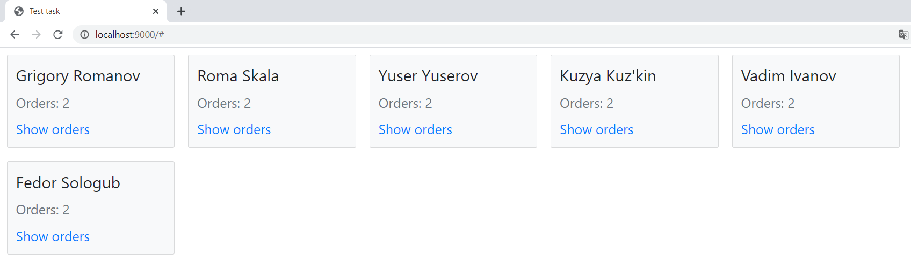
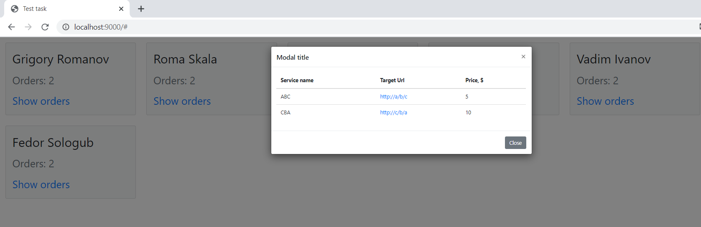

# test-task
AngularJs and Spring Boot 
# Инструкция по деплою
Порт для Postgres по умолчанию: 5433 \
Просто запустить:  
"mvn package" сгенерит .jar файл в test-task\target\test-task-0.0.1-SNAPSHOT.jar  
"java -jar test-task-0.0.1-SNAPSHOT.jar" - сервер будет на http://localhost:9000/ \
Деплой:  
В pom.xml сменить <packaging>jar</packaging> на war, файл test-task\target\test-task-0.0.1-SNAPSHOT.war задеплоить на сервер.

# Само задание
Создать базу данных. В качестве базы данных используется PostgreSQL или H2 (in memory). ORM - Hibernate. В качестве бэка использовать Java + Spring Boot. Бэкенд предоставляет REST API для работы с базой. Работа с базой через spring-data. REST API должен иметь все CRUD методы работы с пользователями.

 Фронтенд на AngularJS v1.7 позволяет просматривать список пользователей и каждого в отдельности. (Только read).
 Выложить результат в git. 
К проекту приложить инструкцию по деплою.

Структура объектов в JSON:

User: {
	id: string,
	firstName: string,
	lastName: string,
	orders: []Order
}

Order: {
	id: string,
	serviceName: string,
	targetUrl: string,
	price: number
}

Нужно реализовать следующие эндпоинты  на фронте
/user
	GET: returns all userObjects
/user/$ID ($ID - числовой параметр)
	GET: returns userObject
	
# Скриншоты

# Выводы
Я совсем немного познакомился с AngularJS, запутался, когда пытался его настроить с webpack'ом, как делал это с Vue.js, поэтому использовал CDN.
